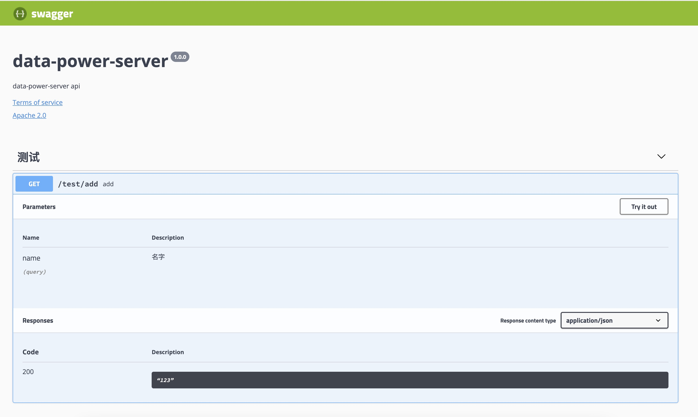

# ts-swagger-doc

A swagger API documentation generator for class-based koa web server.

## Installation

```
npm i ts-swagger-doc
```

## Usage, example below is based off [koatty](https://koatty.org/#/) (a class-based koa framework just like Spring Boot)

1. decorate your controller, action and parameters

```
import {
  Controller,
  BaseController,
  GetMapping,
  RequestParam,
} from 'koatty';
import {
  SwaggerController,
  SwaggerAction,
  SwaggerActionParam,
  SwaggerActionResult,
} from 'ts-swagger-doc';


@SwaggerController('/test', '测试')
@Controller('/test')
export class TestController extends BaseController {
  /**
   * index 接口
   */
  @SwaggerAction('/add', 'get')
  @SwaggerActionResult('123')
  @GetMapping('/add')
  async add(@SwaggerActionParam('name', 'query', '名字') @RequestParam('name') name: string) {
    const id = await this.testService.add(name);
    return this.ok(`已存入数据库，id为${id}`);
  }
```

2. declare koatty plugin to init swagger doc. (koatty plugin will be executed when server booting)
```
/// ./plugins/SwaggerDocPlugin.ts

import { Plugin, IPlugin, Logger, Koatty } from '@tencent/tkoatty';
import SwaggerDoc from '@tencent/tkoatty-swagger-doc';

@Plugin()
export class SwaggerDocPlugin implements IPlugin {
  async run(options: any, app: Koatty) {
    await SwaggerDoc.init(
      '1.0.0',
      'data-power-server',
      'data-power-server api',
    ).serveKoa(app, '/swagger');
    Logger.info('启动swagger文档');
  }
}
```

3. config koatty to run this plugin when booting
```
/// ./config/plugin.ts
export default {
  // 加载的插件列表,执行顺序按照数组元素顺序,plugin在 /src/plugin/ 目录下定义
  list: ['SwaggerDocPlugin'],
  // 插件配置
  config: {},
};

```

## Swagger API Documentation

